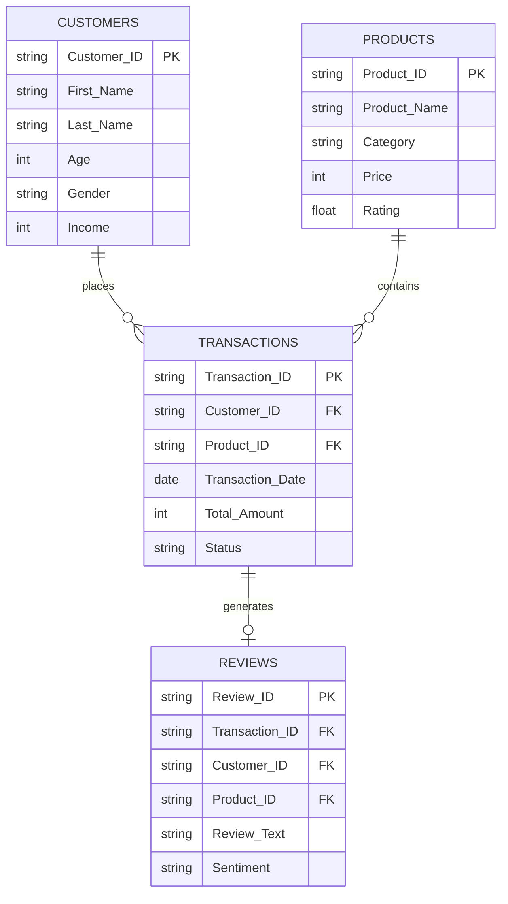

# 🛍️ E-Commerce Dataset Generator for Data Science Training

[](https://www.python.org/downloads/)
[](LICENSE)
[](#datasets-generated)
[](#data-summary)

A comprehensive synthetic e-commerce dataset generator designed for a **20-day Data Science with AI course**. Generates realistic customer, product, transaction, and review data with built-in patterns for statistical analysis, machine learning, and NLP tasks.

---

## 📋 Table of Contents

- [Overview](#overview)
- [Features](#features)
- [Datasets Generated](#datasets-generated)
- [Installation](#installation)
- [Quick Start](#quick-start)
- [Usage](#usage)
- [Data Summary](#data-summary)
- [Use Cases by Course Day](#use-cases-by-course-day)
- [Data Dictionary](#data-dictionary)
- [Advanced Options](#advanced-options)
- [Contributing](#contributing)
- [License](#license)
- [Citation](#citation)

---

## 🎯 Overview

This project generates **realistic synthetic e-commerce datasets** using the Faker library and statistical distributions.

### Why This Dataset?

- ✅ **Realistic patterns**: Seasonality, customer behavior, product popularity
- ✅ **Data quality issues**: Missing values, outliers (for learning)
- ✅ **Correlations**: Income-age, rating-reviews, etc.
- ✅ **Time-series ready**: 5 years of historical data
- ✅ **NLP ready**: Pre-labeled sentiment data
- ✅ **Indian context**: Cities, states, payment methods
- ✅ **Fast generation**: ~2 minutes for 135K+ records
- ✅ **Reproducible**: Fixed random seeds

---

## ✨ Features

### 🎲 Realistic Data Generation
- **Faker-powered**: Realistic names, emails, addresses
- **Statistical distributions**: Gamma, Beta, Log-normal, Zipf
- **Business patterns**: Seasonal trends, customer segments, product popularity
- **Correlations**: Age-income, rating-sales, tenure-loyalty

### 📊 Complete Dataset Coverage
- **Customers** (10,000): Demographics, segments, loyalty
- **Products** (1,000): Categories, pricing, ratings, inventory
- **Transactions** (100,000): 5-year history with seasonality
- **Reviews** (25,000): Sentiment-labeled text for NLP

### 🔧 Customizable
- Configurable record counts
- Adjustable date ranges
- Custom random seeds
- Missing value percentages

---

## 📦 Datasets Generated

| Dataset | Records | Features | Size | Use Cases |
|---------|---------|----------|------|-----------|
| **customers.csv** | 10,000 | 14 | ~2 MB | Segmentation, Demographics, EDA |
| **products.csv** | 1,000 | 18 | ~500 KB | Pricing analysis, Inventory, Classification |
| **transactions.csv** | 100,000 | 16 | ~15 MB | Time-series, Forecasting, Regression |
| **reviews.csv** | 25,000 | 14 | ~5 MB | Sentiment Analysis, NLP, Text Classification |

**Total**: 135,000+ records across 4 interconnected datasets

---

## 🚀 Installation

### Prerequisites
- Python 3.8 or higher
- pip package manager

### Install Dependencies

```bash
# Clone the repository
git clone https://github.com/yourusername/ecommerce-dataset-generator.git
cd ecommerce-dataset-generator

# Install required packages
pip install -r requirements.txt
```

### Requirements.txt
```
faker>=20.0.0
pandas>=2.0.0
numpy>=1.24.0
```


### Generate Individual Datasets

```bash
# 1. Generate customers (required first)
python generate_customers.py

# 2. Generate products (required second)
python generate_products.py

# 3. Generate transactions (requires customers + products)
python generate_transactions.py

# 4. Generate reviews (requires all previous datasets)
python generate_reviews.py
```

---

## 📖 Usage

### Basic Usage

```python
import pandas as pd

# Load generated datasets
customers = pd.read_csv('customers.csv')
products = pd.read_csv('products.csv')
transactions = pd.read_csv('transactions.csv')
reviews = pd.read_csv('reviews.csv')

# Quick exploration
print(customers.head())
print(f"Total customers: {len(customers):,}")
print(f"Total revenue: ₹{transactions['Total_Amount'].sum():,.0f}")
```

### Example Analysis

```python
# Customer segmentation
segment_analysis = customers.groupby('Customer_Segment').agg({
    'Customer_ID': 'count',
    'Income': 'mean',
    'Age': 'mean'
}).round(2)
print(segment_analysis)

# Sentiment distribution
sentiment_dist = reviews['Sentiment'].value_counts(normalize=True)
print(sentiment_dist)

# Monthly sales trend
transactions['Transaction_Date'] = pd.to_datetime(transactions['Transaction_Date'])
monthly_sales = transactions.groupby(
    transactions['Transaction_Date'].dt.to_period('M')
)['Total_Amount'].sum()
monthly_sales.plot(title='Monthly Sales Trend')
```

---

## 📊 Data Summary

### Customers (10,000 records)
- **Age**: 18-80 years (mean: ~48)
- **Income**: ₹180K - ₹6M (mean: ~₹1.2M)
- **Segments**: Budget, Standard, Premium, Luxury
- **Cities**: 15 major Indian cities
- **Missing values**: ~3% (realistic)

### Products (1,000 records)
- **Categories**: 10 (Electronics, Clothing, Books, etc.)
- **Price range**: ₹50 - ₹150K
- **Ratings**: 1.0 - 5.0 (mean: ~4.1)
- **Stock**: 0-1000 units (5% out of stock)

### Transactions (100,000 records)
- **Date range**: 2019-01-01 to 2024-12-31 (5 years)
- **Seasonality**: Higher sales in Oct-Dec (festivals)
- **Payment methods**: UPI (35%), Cards (38%), COD (10%)
- **Status**: 92% completed, 8% pending/cancelled/refunded

### Reviews (25,000 records)
- **Sentiments**: Positive (65%), Neutral (20%), Negative (15%)
- **Verified**: 95% verified purchases
- **Length**: 10-150 words (mean: ~35 words)
- **Aspects**: Quality, Price, Delivery, Service

---

# 📚 Data Dictionary

### customers.csv

| Column | Type | Description | Example |
|--------|------|-------------|---------|
| Customer_ID | string | Unique identifier | CUST_000001 |
| First_Name | string | Customer first name | Rajesh |
| Last_Name | string | Customer last name | Kumar |
| Age | integer | Age in years (18-80) | 34 |
| Gender | string | Male/Female/Other | Male |
| City | string | City of residence | Hyderabad |
| State | string | State of residence | Telangana |
| Income | integer | Annual income (₹) | 1,250,000 |
| Email | string | Email address | cust_000001@gmail.com |
| Phone | string | Phone number | +91-9876543210 |
| Join_Date | date | Account creation date | 2021-05-15 |
| Customer_Segment | string | Budget/Standard/Premium/Luxury | Premium |
| Account_Status | string | Active/Inactive/Suspended | Active |
| Preferred_Language | string | English/Hindi/Telugu/Tamil/Bengali | English |
| Loyalty_Points | integer | Accumulated points | 2,450 |

### products.csv

| Column | Type | Description | Example |
|--------|------|-------------|---------|
| Product_ID | string | Unique identifier | PROD_00001 |
| Product_Name | string | Product name | Samsung Mobile Pro Max Blue |
| Category | string | Main category | Electronics |
| Subcategory | string | Sub-category | Mobile Phones |
| Brand | string | Brand name | Samsung |
| Price | integer | Original price (₹) | 45,000 |
| Discount_Percent | integer | Discount percentage | 15 |
| Final_Price | integer | Price after discount | 38,250 |
| Rating | float | Average rating (1-5) | 4.3 |
| Number_of_Reviews | integer | Total reviews | 256 |
| Stock_Quantity | integer | Available units | 145 |
| Weight_kg | float | Product weight | 0.25 |
| Length_cm | float | Length dimension | 15.5 |
| Width_cm | float | Width dimension | 7.8 |
| Height_cm | float | Height dimension | 0.9 |
| Color | string | Product color | Blue |
| Warranty_Months | integer | Warranty period | 12 |
| Is_Featured | boolean | Featured product flag | True |
| Image_Path | string | Image file path | images/products/electronics/prod_00001.jpg |
| Launch_Date | date | Product launch date | 2023-08-20 |

### transactions.csv

| Column | Type | Description | Example |
|--------|------|-------------|---------|
| Transaction_ID | string | Unique identifier | TXN_0000001 |
| Customer_ID | string | Reference to customer | CUST_000123 |
| Product_ID | string | Reference to product | PROD_00456 |
| Transaction_Date | date | Purchase date | 2024-03-15 |
| Transaction_Time | time | Purchase time | 14:25:30 |
| Quantity | integer | Number of units | 2 |
| Unit_Price | integer | Price per unit (₹) | 1,200 |
| Total_Amount | integer | Total payment (₹) | 2,400 |
| Payment_Method | string | UPI/Credit Card/Debit Card/etc | UPI |
| Status | string | Completed/Pending/Cancelled/Refunded | Completed |
| Shipping_City | string | Delivery city | Bangalore |
| Shipping_State | string | Delivery state | Karnataka |
| Delivery_Days | integer | Days to deliver | 3 |
| Coupon_Code | string | Coupon applied | SAVE10 |
| Coupon_Discount | integer | Discount amount (₹) | 240 |
| Customer_Rating | float | Post-purchase rating | 4.5 |

### reviews.csv

| Column | Type | Description | Example |
|--------|------|-------------|---------|
| Review_ID | string | Unique identifier | REV_0000001 |
| Transaction_ID | string | Reference to transaction | TXN_0012345 |
| Customer_ID | string | Reference to customer | CUST_000456 |
| Product_ID | string | Reference to product | PROD_00234 |
| Reviewer_Name | string | Display name | Rajesh (or Anonymous) |
| Rating | float | Review rating (1-5) | 5.0 |
| Review_Title | string | Short summary | Great product! |
| Review_Text | string | Full review text | Excellent quality product! Battery life is excellent... |
| Review_Date | date | Review posted date | 2024-03-22 |
| Verified_Purchase | boolean | Verified buyer flag | True |
| Helpful_Votes | integer | Helpful count | 23 |
| Sentiment | string | **positive/negative/neutral** | positive |
| Aspects_Mentioned | string | Comma-separated aspects | quality, price, delivery |
| Review_Length_Words | integer | Word count | 45 |

---

## 🎨 Advanced Options

### Customize Record Counts

Edit configuration in each generator file:

```python
# In generate_customers.py
NUM_CUSTOMERS = 20000  # Change from 10000

# In generate_products.py
NUM_PRODUCTS = 2000  # Change from 1000

# In generate_transactions.py
NUM_TRANSACTIONS = 200000  # Change from 100000

# In generate_reviews.py
NUM_REVIEWS = 50000  # Change from 25000
```

### Change Date Range

```python
# In generator files
START_DATE = datetime(2020, 1, 1)  # Change start date
END_DATE = datetime(2025, 12, 31)  # Change end date
```

### Adjust Random Seed

```python
# For reproducibility
Faker.seed(42)  # Change seed value
np.random.seed(42)
random.seed(42)
```

### Modify Missing Value Percentage

```python
# In generate_customers.py
missing_rate = 0.05  # 5% missing values (change as needed)
missing_indices = np.random.choice(NUM_CUSTOMERS, 
                                   size=int(NUM_CUSTOMERS * missing_rate), 
                                   replace=False)
```

---

## 🔗 Data Relationships



---

## 📈 Sample Analyses

### Customer Lifetime Value

```python
# Calculate CLV
customer_clv = transactions.groupby('Customer_ID').agg({
    'Total_Amount': 'sum',
    'Transaction_ID': 'count'
}).rename(columns={'Total_Amount': 'CLV', 'Transaction_ID': 'Purchase_Count'})

# Merge with customer data
clv_analysis = customers.merge(customer_clv, on='Customer_ID')

# Visualize
import matplotlib.pyplot as plt
clv_analysis.plot(x='Age', y='CLV', kind='scatter', alpha=0.5)
plt.title('Customer Lifetime Value vs Age')
plt.show()
```

### Sentiment Analysis

```python
from sklearn.feature_extraction.text import TfidfVectorizer
from sklearn.model_selection import train_test_split
from sklearn.linear_model import LogisticRegression

# Prepare data
X = reviews['Review_Text']
y = reviews['Sentiment']

# Split
X_train, X_test, y_train, y_test = train_test_split(X, y, test_size=0.2)

# Vectorize
vectorizer = TfidfVectorizer(max_features=1000)
X_train_vec = vectorizer.fit_transform(X_train)
X_test_vec = vectorizer.transform(X_test)

# Train model
model = LogisticRegression(max_iter=1000)
model.fit(X_train_vec, y_train)

# Evaluate
print(f"Accuracy: {model.score(X_test_vec, y_test):.2f}")
```

### Sales Forecasting

```python
# Aggregate daily sales
daily_sales = transactions.groupby('Transaction_Date')['Total_Amount'].sum()

# Simple moving average
from pandas import DatetimeIndex
daily_sales.index = pd.to_datetime(daily_sales.index)
daily_sales_ma = daily_sales.rolling(window=30).mean()

# Plot
plt.figure(figsize=(15, 5))
plt.plot(daily_sales.index, daily_sales, alpha=0.3, label='Daily Sales')
plt.plot(daily_sales_ma.index, daily_sales_ma, label='30-Day Moving Average')
plt.legend()
plt.title('Sales Trend Analysis')
plt.show()
```

---

## 🤝 Contributing

Contributions are welcome! Here's how you can help:

1. **Fork the repository**
2. **Create a feature branch**: `git checkout -b feature/AmazingFeature`
3. **Commit changes**: `git commit -m 'Add some AmazingFeature'`
4. **Push to branch**: `git push origin feature/AmazingFeature`
5. **Open a Pull Request**

### Ideas for Contribution
- Add more product categories
- Include image generation (actual images, not just paths)
- Add geographical coordinates for cities
- Create visualization dashboard
- Add more NLP variations (questions, chatbot data)
- Multi-language support for reviews

---

## 📄 License

This project is licensed under the MIT License - see the [LICENSE](LICENSE) file for details.

```
MIT License

Copyright (c) 2025 Esa Syed

Permission is hereby granted, free of charge, to any person obtaining a copy
of this software and associated documentation files (the "Software"), to deal
in the Software without restriction...
```

---

## 🙏 Acknowledgments

- **Faker**: For realistic data generation
- **NumPy & Pandas**: For data manipulation
- **Full Stack Academy**: For the 20-day Data Science curriculum design
- **Indian E-commerce**: Inspired by Flipkart, Amazon India patterns

---

## 📞 Support

- **Issues**: [GitHub Issues](https://github.com/yourusername/ecommerce-dataset-generator/issues)
- **Discussions**: [GitHub Discussions](https://github.com/yourusername/ecommerce-dataset-generator/discussions)
- **Email**: esa@tekcentrics.com

---

## 📊 Citation

If you use this dataset in your research or course, please cite:

```bibtex
@misc{ecommerce_dataset_2025,
  author = {Full Stack Academy},
  title = {E-Commerce Dataset Generator for Data Science Training},
  year = {2025},
  publisher = {GitHub},
  url = {https://github.com/yourusername/ecommerce-dataset-generator}
}
```

---

## 🗺️ Roadmap

- [x] Customer data generation
- [x] Product catalog generation
- [x] Transaction history with seasonality
- [x] Review text with sentiment labels
- [ ] Actual product images (via stable diffusion)
- [ ] Chatbot conversation logs
- [ ] Customer support tickets
- [ ] Social media mentions
- [ ] Multi-language reviews
- [ ] Real-time streaming data generator

---

## ⭐ Star History

If you find this project useful, please consider giving it a star! ⭐

[](https://star-history.com/#yourusername/ecommerce-dataset-generator&Date)

---

## 📸 Screenshots

### Dataset Overview


### Sample Analysis


### Sentiment Distribution


---

**Made with ❤️ for Data Science Education**

[⬆ Back to Top](#-e-commerce-dataset-generator-for-data-science-training)
